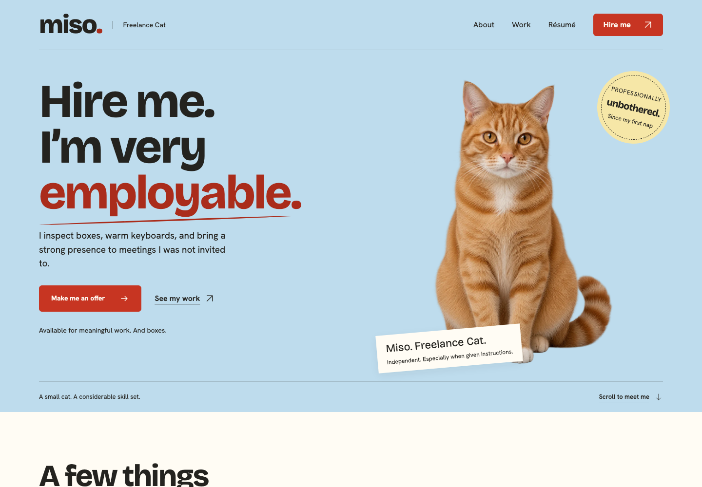

# miso-hire-me

A complete personal portfolio belonging to **Miso, Freelance Cat**. One fictional ginger tabby, four specialist services, three professional-looking work stories, and a local offer negotiation that takes ordinary cat behavior very seriously.

Built with Next.js 16.3.4, App Router, React 19.3.0 and strict TypeScript. **No database or service keys are required.** Production is static HTML, CSS, JavaScript, fonts and images. All mutable visitor data stays in the browser.



[Full desktop capture](docs/captures/home-1440.png) · [Full mobile capture](docs/captures/home-390.png) · [Mobile first viewport](docs/captures/home-viewport-390.png)

## Run and build

Use Node.js 22 or later and npm. Dependencies are locked in `package-lock.json`.

```sh
npm ci
npm run dev
```

Development: http://127.0.0.1:3005

```sh
npm run build
npm run preview
```

Static production preview: http://127.0.0.1:3006. The complete portable output is `out/`. The preview script serves nested `index.html` routes directly, gzip-compressed text assets and a real 404 page. It has no application logic or database. Stop a preview with Ctrl+C in its terminal.

## Implemented routes

| Route | Experience |
| --- | --- |
| `/` | Introduction, four services, selected work, strengths, interview, object references and hire invitation |
| `/about/` | Personal story, studio photos and matching wake/nap interaction |
| `/work/` | Three complete fictional case studies |
| `/work/laptop-warming/` | The Laptop Warming Initiative |
| `/work/box-04/` | Box 04: Quality Assurance |
| `/work/sofa-occupancy/` | The Sofa Occupancy Project |
| `/resume/` | Designed résumé, actual PDF download and readable print view |
| `/hire/` | Three-step form, validation, service preselection and persistent draft |
| `/my-offers/` | Local draft/history, resume, withdrawal and confirmed deletion |
| `/offer/?ref=…` | Local record, deterministic response, explicit counterterms, acceptance and PNG export |
| `/demo/` | Opt-in sample scenario, local-data explanation and scoped reset |
| `/the-fine-print/` | Fictional working terms and factual demo/storage disclosure |
| Unknown route/reference | Useful page-not-found or missing-browser-record explanation |

## A visitor walkthrough

1. Meet Miso, explore a work story, ask an interview question, or wake him on About.
2. Choose **Make me an offer**, or load the sample at `/demo/`.
3. Fill role/conditions, choose imaginary treats, and review. **Send demo offer** runs a scripted response in this browser.
4. The sample offers 2 treats for 30 minutes of Box Inspection with sunshine but asks to return the box. Miso requests exactly **4 imaginary treats and keeping the empty box**.
5. Review the changed terms and choose **Accept Miso’s terms**, edit the proposal, or decline/withdraw it.
6. An accepted offer can download a real **1080 × 1350 “I hired Miso” PNG**. Revisit history, withdraw, delete, or reset only this demo's data.

## Local data and limits

The schema-versioned key is `miso-hire-me:demo:v1`. It contains draft fields, submitted records, ISO timestamps, original/current/accepted terms, authored responses and a small awake preference. Stable UUID-based IDs and idempotent mutations prevent duplicate submissions from repeated clicks.

Storage is validated and read after hydration; public content never depends on it. Same-origin tabs refresh one another, and mutations re-read current values. This is best-effort local consistency, not a database transaction. Data is user-editable, removable by clearing site data, and unavailable in another browser/device.

If storage is full, blocked or corrupted, the site reports that the change **was not saved**. An explicit temporary-session option keeps state only in the open tab's memory; refreshing or closing loses it. Damaged/unsupported stored data is preserved until a confirmed reset. Reset removes only keys with this app's namespace; it never calls `localStorage.clear()`.

A personal offer URL cannot transfer its browser-local record. Share the exported PNG file instead. No real cat, person, message, contract, animal booking, payment, or feeding quantity is involved.

## Downloaded artifacts and regeneration

- [Résumé PDF](public/downloads/miso-freelance-cat-resume.pdf), generated from the actual print view.
- [Example hire card](docs/examples/i-hired-miso.png) and [long-name stress case](docs/examples/i-hired-miso-long-name.png), downloaded through the browser interaction.
- [Homepage social cover](public/social/home.png) and [all covers at thumbnail/square crops](docs/captures/social-previews.png).

```sh
npm run assets          # deterministic social covers; no image-generation service needed
npm run export:resume   # requires the dev preview on port 3005
npm run build           # include regenerated files in out/
```

For a different running preview, set `MISO_PREVIEW_URL` when generating the résumé. The résumé source is `app/resume/page.tsx` and print CSS; PNG card source is `lib/card-export.ts`. Both use the local fonts and approved cat imagery. Generated images are already bundled; regeneration is optional.

## Social origin and publication

The only optional application setting is `NEXT_PUBLIC_SITE_ORIGIN`. The local default is `http://localhost:3005`. See `.env.example` and [SOCIAL-PREVIEWS.md](docs/SOCIAL-PREVIEWS.md). Before any future authorized public build, set the verified deployed HTTPS origin and rebuild. Never publish localhost metadata. No public deployment or platform unfurl testing has been performed.

## Verification

```sh
npm run typecheck
npm run lint
npm test
npm run build
npm run test:browser
npm run measure
```

The browser suite uses the static export and starts a local preview if one is not already running. It covers direct routes/metadata/assets, service links, validation, refresh, edits, duplicate submission, counterterms, acceptance, withdrawal/deletion, cross-tab updates, separate browser contexts, storage failure, scoped reset, keyboard interactions, actual downloads, and responsive/accessibility checks. Tests use clean isolated browser contexts and never alter the user's browsing data.

See [QA.md](docs/QA.md) for actual results, measured performance, captures, limitations, and unrun checks. `npm run measure` requires the static preview and records synthetic Chromium results, not invented scores or field data. Chromium must be available to Playwright; if absent, install it with `npx playwright install chromium`.

## Project documentation and credits

Read [AGENTS.md](AGENTS.md), [CHARACTER.md](CHARACTER.md), [PRODUCT.md](PRODUCT.md), [DESIGN.md](DESIGN.md), and [STATUS.md](docs/STATUS.md) before extending. [ARCHITECTURE.md](docs/ARCHITECTURE.md) documents the state/storage/export boundaries. [ASSETS.md](docs/ASSETS.md) and [image-generation.json](docs/image-generation.json) record exact prompts and provenance. A portable approved original reference is in `docs/reference/miso-approved-reference.png`.

Eleven original fictional photographs were created with built-in image_gen, with a fixed Miso identity reference and shared studio reference. Slight generated continuity differences are documented. Local Bricolage Grotesque and Hanken Grotesk fonts are distributed under their included SIL Open Font Licenses. No stock pet-account imagery, actual endorsements, purchased assets, or tracking are used.

[Agency case-study draft](docs/AGENCY-CASE-STUDY.md) describes the work without fabricated audience or commercial results.
